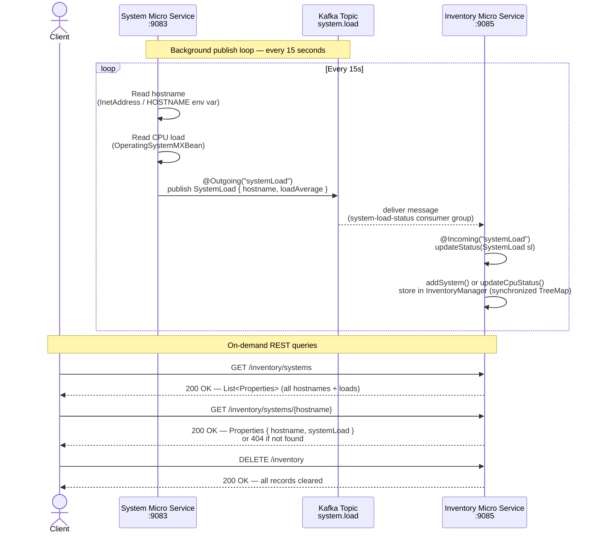

# Microservice Interaction Sequence Diagram

## Overview

This guide demonstrates two microservices communicating via event-driven messaging:

- **Event-driven** (Apache Kafka / MicroProfile Reactive Messaging): System Microservice → Inventory Microservice
- **RESTful API**: Client → Inventory Microservice

## Services

| Service                | Port | Role                                                             |
| ---------------------- | ---- | ---------------------------------------------------------------- |
| System Microservice    | 9083 | Publishes CPU load metrics to Kafka every 15 seconds             |
| Inventory Microservice | 9085 | Consumes metrics from Kafka; exposes REST endpoints for querying |

---

## Sequence Diagram



---

## Key Design Details

### System → Inventory (Kafka / Reactive Messaging)

- `SystemService.sendSystemLoad()` is annotated with `@Outgoing("systemLoad")` and returns a `Publisher<SystemLoad>`. The MicroProfile Reactive Messaging runtime subscribes to the publisher and routes each emission to the Kafka connector.
- RxJava3's `Flowable.interval(15, TimeUnit.SECONDS)` drives the emission cadence. It is back-pressure-aware: the runtime controls how fast items are consumed, preventing unbounded buffering.
- `InventoryResource.updateStatus()` is annotated with `@Incoming("systemLoad")`. The runtime calls it for each deserialized message — no polling, offset management, or thread lifecycle code in the application.
- Both services bind their logical channel name (`systemLoad`) to the physical Kafka topic (`system.load`) via `microprofile-config.properties`. The services share no code-level coupling; they only share the topic name and the `SystemLoad` model.

### Channel → Kafka Topic Binding

```
System Microservice                         Inventory Microservice
@Outgoing("systemLoad")                @Incoming("systemLoad")
        |                                       |
        | microprofile-config.properties        | microprofile-config.properties
        v                                       v
mp.messaging.outgoing                  mp.messaging.incoming
  .systemLoad.topic=system.load          .systemLoad.topic=system.load
  .systemLoad.connector=liberty-kafka    .systemLoad.connector=liberty-kafka
                    \                       /
                     \                     /
                      [  Kafka: system.load topic  ]
```

### Serialization / Deserialization

- `SystemLoad` is transmitted as JSON bytes using inner classes that implement Kafka's `Serializer`/`Deserializer` interfaces backed by Jakarta JSONB.
- The same `$SystemLoadSerializer` class path is referenced in both config files, guaranteeing wire format consistency between producer and consumer.

### Data Model

```
SystemLoad
├── hostname:     String   (e.g. "inventory-service-host")
└── loadAverage:  Double   (-1.0 if the OS does not support measurement)
```

### Inventory Storage

- `InventoryManager` wraps a `TreeMap<String, Properties>` with `Collections.synchronizedMap` to handle concurrent writes from the `@Incoming` listener and concurrent reads from REST handlers.
- `addSystem()` is called on first encounter; `updateCpuStatus()` is called on subsequent messages for the same hostname.
- `TreeMap` keeps hostnames in lexicographic order, making REST list responses deterministic.
